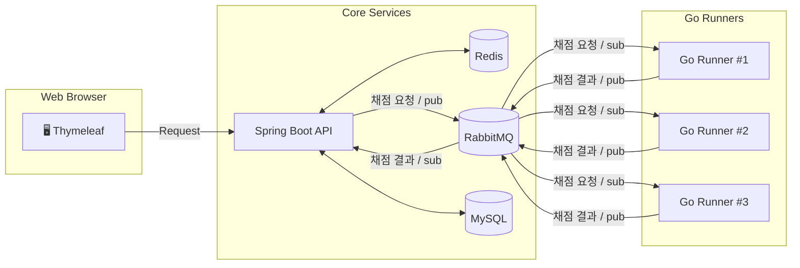

# 📚 JHP-World

> **Spring Boot, RabbitMQ, Go를 활용해 만든 알고리즘 과제 채점 플랫폼입니다.**  
> PDF 형식의 문제 파일을 업로드하고, C/C++ 풀이 코드를 미리 등록된 테스트 케이스로 자동 채점할 수 있습니다.</br> 
> 또한, 관리자 페이지를 통해 사용자와 과제를 손쉽게 관리할 수 있습니다.


<p align="center">
  
  
  
</p>

🎈 [채점 서버 (JHP-World-micro-server)](https://github.com/Feedbaek/JHP-World-micro-server)

💽 [PDF 파일 저장소 (JHP-World-File-Storage)](https://github.com/Feedbaek/JHP-World-File-Storage/pull/1)

---

## ✨ 주요 기능

| 분류        | 설명                                                                                     |
|-----------|----------------------------------------------------------------------------------------|
| **과제 관리** | • 과제 CRUD <br>• PDF 파일 무료 업로드                                                          |
| **테스트케이스 관리** | • 사용자 개별 테스트케이스 등록 <br>• 관리자 테스트케이스 등록                                                 |
| **코드 실행** | • Go로 구현된 경량 실행 서버 <br>• Docker 기반 샌드박스 환경 <br>• 리소스/시간 제한 기능 포함 <br>• RabbitMQ 기반 채점 요청 큐 처리 |
| **채점 결과** | • 실행 시간 및 메모리 사용량 제공 <br>• 채점 결과 비교 <br>• 제출 히스토리 확인 가능                                |
| **토론 게시판** | • 과제별 토론 게시판                                                  |
| **관리자 기능** | • 사용자/과제/테스트케이스 CRUD <br>• 역할 기반 권한 관리                             |
| **부가 기능** | • Redis 세션 관리 및 캐시 활용 <br>• 방문 로그 기록                                           |

---

## 🏗️  아키텍처



---

## 🛠  기술 스택

* **Backend**: Spring Boot, Spring Security, Spring Data JPA
* **Message Broker**: RabbitMQ
* **Runner**: Go, Docker
* **Database**: MySQL, Redis (session & cache)
* **Frontend**: Thymeleaf
* **Container**: Docker

---

## 🚀  Getting Started

### 사전 준비 사항

```bash
# 필요 소프트웨어
✅JDK 17 이상
✅Go 1.22 이상
✅Docker
```

### 로컬 실행 방법

```bash
# 1. 저장소 클론
$ git clone https://github.com/Feedbaek/JHP-World.git && cd JHP-World

# 2. 환경 변수 설정
$ vi application.yml
$ vi application-oauth2.yml # 파일을 수정하여 DB, Redis, RabbitMQ 설정을 맞춤화합니다.

# 3. 의존 서비스 실행 (docker-compose 추가 예정)
$ docker compose up -d  # mysql, redis, rabbitmq 등 실행

# 4. Spring Boot 서버 실행
$ ./mvnw spring-boot:run

# 5. 접속
→ http://localhost:8080  # 사용자 포털
→ http://localhost:8080/admin  # 관리자 페이지 (기본 계정: admin / admin)
```

> **TIP:** API까지 포함한 전체 컨테이너 실행은 `docker-compose.full.yml`을 사용하세요.

---


## 📂  Project Layout

```text
src/main/java/minskim2.JHP_World/
├─ config/          # 설정 클래스
├─ domain/          # 도메인 클래스
├─ global/          # 공통 클래스
└─ router/       
  ├─ api/           # REST API 컨트롤러
  └─ view/          # 뷰 컨트롤러

src/main/resources/
├─ application.yml         # Spring Boot 설정
├─ application-oauth2.yml  # OAuth2 설정
├─ static/                 # 정적 리소스
├─ templates/              # Thymeleaf 템플릿
└─ db/
  └─ migration/            # Flyway 마이그레이션
```

---

## 🙌 기여 방법

1. 프로젝트를 포크하고 브랜치 생성: `git checkout -b feature/awesome`
2. 변경 사항 커밋: `git commit -m 'feat: awesome 기능 추가'`
3. 브랜치 푸시: `git push origin feature/awesome`
4. Pull Request 요청 🚀

---

## 📄  License

본 프로젝트는 **MIT License** 하에 배포됩니다.

---

## 🌟  참고 자료

- [Spring Boot](https://spring.io/projects/spring-boot)
- [RabbitMQ](https://www.rabbitmq.com/)
- [Go](https://go.dev/)
- [Redis](https://redis.io/)

---

> Made with by **김민석** and contributors
